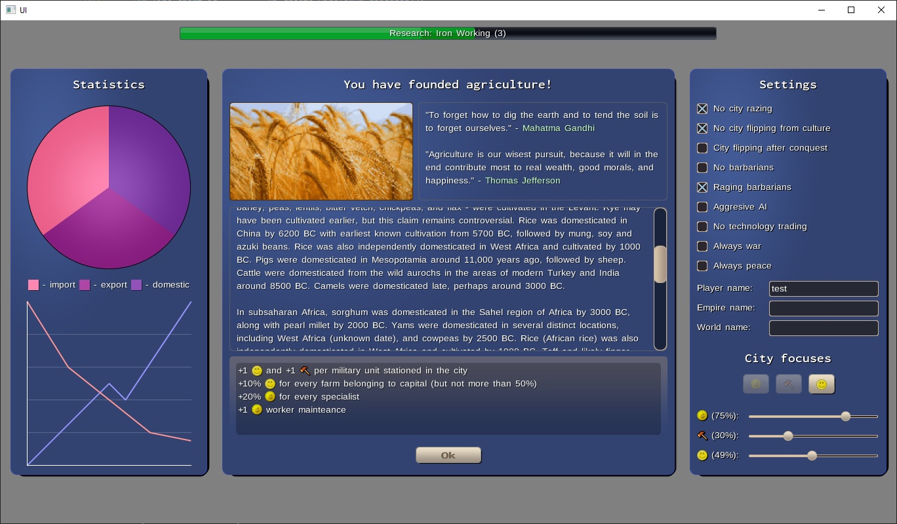

# Lemao

Simple game engine written in Rust, without any dependencies except the most necessary ones (WinAPI, OpenGL, OpenAL, and bindgen to generate bindings).

Supported asset formats:
 - textures: [BMP](https://docs.fileformat.com/image/bmp/) (8/24/32 bits per pixel)
 - fonts: [BFF](https://documentation.help/Codehead-Bitmap-Font-Generator/bffformat.html) (8/24/32 bits per pixel)
 - audio: [WAV](https://docs.fileformat.com/audio/wav/) (mono and stereo)

This project is done entirely for fun and challenge, so it doesn't have a lot of components present in other modern engines - nevertheless, the goal is to make it fully functional at some point.

Lemao components:
 - lemao-bindgen - [bindgen](https://github.com/rust-lang/rust-bindgen) fork with a custom change allowing to generate function pointers without Option wrapper
 - lemao-core - the main subsystem containing the renderer and coordinating the work of other components
 - lemao-math - a set of math helpers (vectors, matrices, colors) with support for SIMD
 - lemao-openal - binding for OpenAL 
 - lemao-opengl - binding for OpenGL
 - lemao-platforms
   - lemao-common-platforms - common interface implemented by all window subsystems
   - lemao-linux-x11 - window subsystem for Linux and X11
   - lemao-windows-winapi - window subsystem for Windows and WinAPI
 - lemao-ui - a set of UI components

